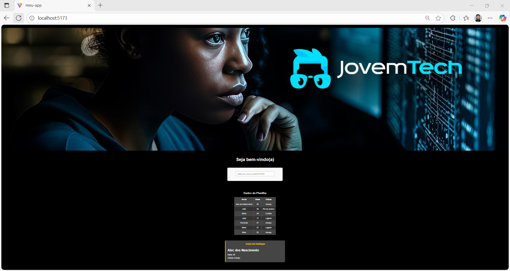

## 👨‍🏫 Professor
[<br><sub>Claudeny Avelino</sub>](https://github.com/ClaudenyAvelino)
 
**E-mail:** claudeny.avelino@gmail.com  
**Turma:** JOVEM-TECH-ReactJS

# Projeto de Aprendizado React: Dashboard Interativo

Este é um projeto de front-end desenvolvido com o objetivo de praticar e demonstrar conceitos fundamentais e intermediários da biblioteca ReactJS. A aplicação exibe dados consumidos de uma planilha do Google Sheets, apresentando-os em uma tabela e destacando o primeiro registro. Além disso, a interface conta com componentes interativos e um design responsivo.




---

## ✨ Funcionalidades

- **Banner Responsivo:** Um banner no topo da página que se adapta a diferentes tamanhos de tela.
- **Componente Interativo:** Um campo de saudação que reage em tempo real à entrada do usuário.
- **Consumo de Dados Externos:** Busca e processa dados de uma planilha do Google Sheets publicada na web em formato CSV.
- **Exibição de Dados:**
  - **Componente de Destaque:** Exibe os dados do primeiro aluno da planilha em um card especial.
  - **Tabela de Dados:** Renderiza todos os dados da planilha em uma tabela estilizada.
- **Design Responsivo:** A interface se ajusta para proporcionar uma boa experiência em desktops, tablets e celulares.
- **Tema Escuro:** Estilo visual moderno com um fundo preto e textos contrastantes.

---

## 🚀 Tecnologias Utilizadas

- **ReactJS:** Biblioteca principal para a construção da interface de usuário.
- **Vite:** Ferramenta de build moderna e ultrarrápida para o ambiente de desenvolvimento.
- **JavaScript (ES6+):** Linguagem base para toda a lógica da aplicação.
- **CSS3:** Para estilização, incluindo o uso de **Flexbox** para layout e **Media Queries** para responsividade.
- **HTML5:** Para a estruturação semântica do conteúdo.

---

## ⚙️ Como Executar o Projeto

Siga os passos abaixo para rodar o projeto em sua máquina local.

### Pré-requisitos

- [Node.js](https://nodejs.org/en/) (versão 16 ou superior)
- [NPM](https://www.npmjs.com/) ou [Yarn](https://yarnpkg.com/)

### Instalação

```
npm create vite@latest meu-app
```
**Instalar dependências**
```
npm install
```
**Entrar na pasta do projeto**
```
cd meu-app
```
**Rodar o projeto**
```
npm run dev
```


1.  **Clone o repositório:**
    ```bash
    git clone https://github.com/seu-usuario/seu-repositorio.git
    ```

2.  **Acesse a pasta do projeto:**
    ```bash
    cd nome-do-projeto
    ```

3.  **Instale as dependências:**
    ```bash
    npm install
    ```

### Configuração

Antes de iniciar, você precisa configurar a URL da sua planilha do Google Sheets.

1.  Abra sua planilha no Google Sheets.
2.  Vá em `Arquivo` > `Compartilhar` > `Publicar na web`.
3.  Na janela que abrir, em "Link", selecione a aba da planilha desejada e escolha o formato **"Valores separados por vírgula (.csv)"**.
4.  Clique em **"Publicar"**.
5.  Copie o link gerado.
6.  Abra o arquivo `src/App.jsx` e substitua a URL na constante `URL_DA_PLANILHA` pelo link que você copiou.

### Iniciando a Aplicação

Com tudo configurado, execute o seguinte comando para iniciar o servidor de desenvolvimento:
```bash
npm run dev
```
A aplicação estará disponível em `http://localhost:5173` (ou outra porta indicada no terminal).

---

## 📁 Estrutura do Diretório

O projeto é organizado em uma estrutura baseada em componentes, facilitando a manutenção e a escalabilidade.

```
src/
├── Componentes/
│   ├── AlunoDestaque/
│   ├── Banner/
│   ├── BemVindo/
│   ├── Planilha/
│   └── Saudacao/
├── App.css
├── App.jsx
└── main.jsx
```

---

## 🎓 Principais Conceitos de React Abordados

- **Arquitetura de Componentes:** Divisão da UI em partes isoladas e reutilizáveis.
- **Estado e Interatividade (`useState`):** Gerenciamento de dados que mudam ao longo do tempo em resposta a ações do usuário.
- **Efeitos Colaterais (`useEffect`):** Execução de código que interage com sistemas externos, como a busca de dados em uma API (Fetch).
- **Passagem de Dados (`Props`):** Comunicação entre componentes, passando dados de um componente pai para um filho.
- **Elevação de Estado (Lifting State Up):** Centralização do estado em um componente pai comum para compartilhar dados entre componentes irmãos.
- **Renderização Condicional:** Exibição de diferentes JSX com base em condições lógicas.
- **Renderização de Listas e Chaves (`.map()` e `key`):** Transformação de arrays de dados em elementos de UI.
